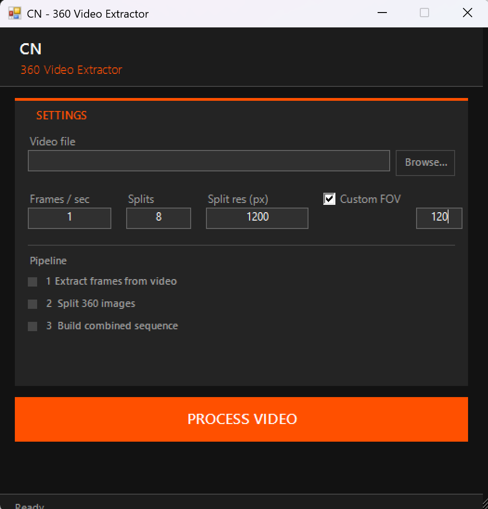

# CN 360 Video Extractor

Extracts frames from 360° videos and splits them into perspective tiles for use in Gaussian splatting or photogrammetry software.

No installation required. Drop in a video, set your settings, click **PROCESS VIDEO**.



---

## How it works

The app runs three steps automatically:

1. **Extract frames** — FFmpeg pulls individual frames from your 360° video at the chosen rate
2. **Split 360 images** — AliceVision converts each equirectangular frame into perspective tiles
3. **Build sequence** — tiles are interleaved into a flat numbered sequence ready for import

---

## Getting started

### Windows
Double-click `start_gui.bat`

### macOS
Double-click `start_mac.command`
> First time: right-click > Open to bypass Gatekeeper

### Linux
```bash
bash start_linux.sh
```
Requires: `python3`, `python3-tk`
```bash
sudo apt install python3-tk
```

---

## Settings

| Setting | Description | Default |
|---|---|---|
| Frames / sec | How many frames to extract per second of video | 1 |
| Splits | Number of perspective tiles per frame | 8 |
| Split res (px) | Width/height of each output tile | 1200 |
| Custom FOV | Field of view in degrees for the splitter | 90 |

---

## Requirements

Binaries are **not included** in this repo (too large for GitHub). Download and place them in a `bin/` folder next to the scripts.

### FFmpeg
- Windows / macOS / Linux: https://ffmpeg.org/download.html
- macOS (Homebrew): `brew install ffmpeg`
- Linux: `sudo apt install ffmpeg`

### AliceVision
Download a release for your platform: https://github.com/alicevision/AliceVision/releases

Extract and copy these files into `bin/`:
- `aliceVision_split360Images` (or `.exe` on Windows)
- All accompanying `.dll` / `.so` files

---

## Building the macOS DMG

Run on a Mac from the repo root:
```bash
chmod +x macos/build_dmg.sh
./macos/build_dmg.sh
```
Requires Python 3 + tkinter (`brew install python-tk`). Outputs `CN360Extractor.dmg`.

---

## Licenses

**FFmpeg** — GNU LGPL v2.1 or later (portions GPL v2+) — https://ffmpeg.org/legal.html

**AliceVision** — Mozilla Public License 2.0 — https://github.com/alicevision/AliceVision/blob/develop/LICENSE
